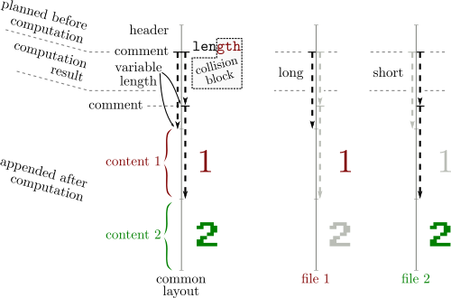
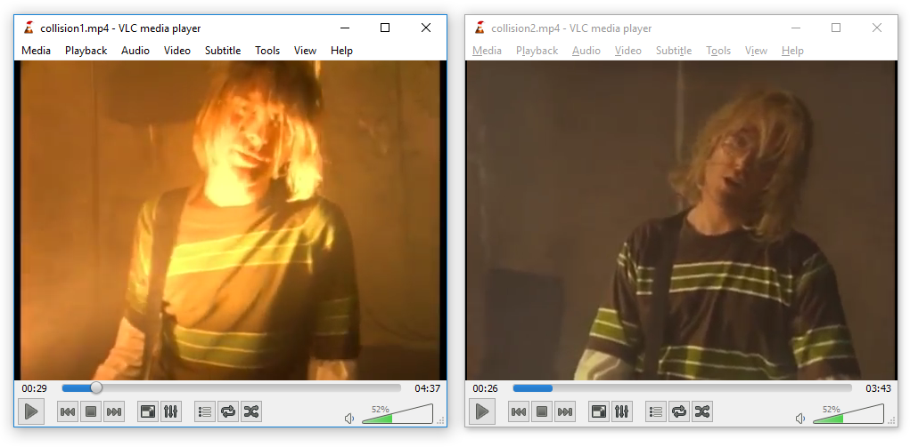
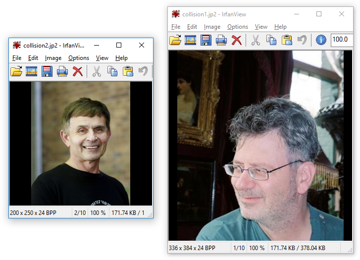
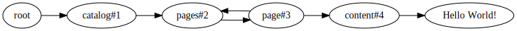
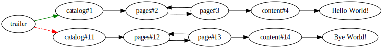
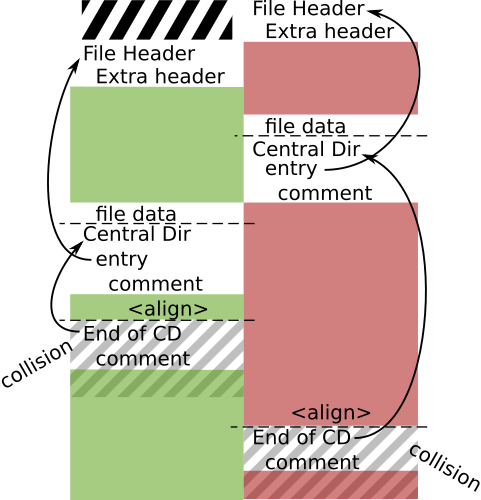
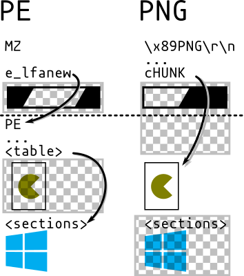
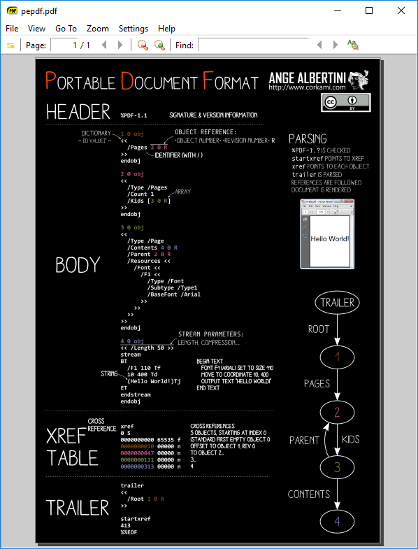
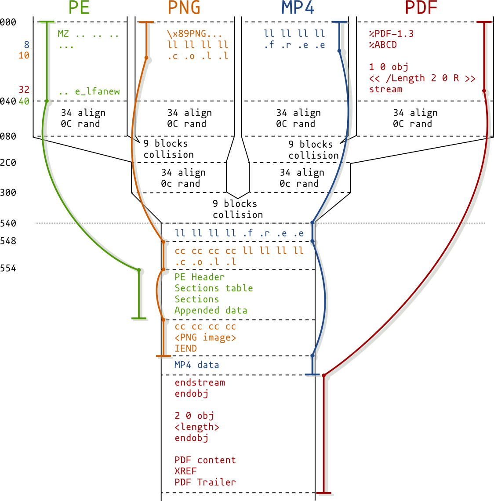
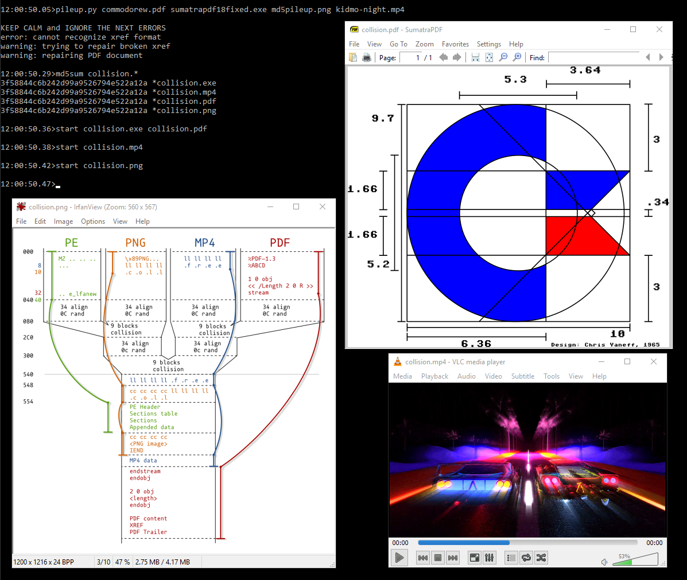

# Hash collisions and exploitations

By Ange Albertini and Marc Stevens.


## FAQ (TL;DR)

Q: Is it possible to make a file get an arbitrary MD2/MD4/MD5/MD6/SHA1/SHA2/SHA3, or the same hash as another file?<br/>
A: No.

Q: Can one create 2 different files with the same hash?<br/>
A: With MD5, in [a few seconds on a standard computer](#fastcoll-md5). With SHA1, it's [possible](#shattered-sha1) but not practical for end-users (Complexity: 2^61.2 Price: $11k).

Q: Can one make 2 different files get the same hash by appending stuff?<br/>
A: With MD5, in [a few hours on a standard computer](#hashclash-md5). With SHA1, it's [possible](#shambles-sha-1) but not practical for end-users (Complexity: 2^63.4 Price: $45K)

Q: Will the 2 files remain valid?<br/>
A: In general, yes, as most file formats tolerate appended data. OTOH files signatures will be likely broken.

Q: Can one make 2 different files with arbitrary contents and the same hash?<br/>
A: Yes, it can be instant by relying on special file structures:<br/>
1. a special format header (or pair) with tricks, acting as a switch between 2 contents (some formats won't allow such tricks).<br/>
2. pre-computed collisions, based on the specific header(s).<br/>
3. two contents of specific formats, both presents after the collision (added after the computation).

Q: Which formats can I get instant MD5-colliding files pair for?<br/>
A: [JPG](scripts/jpg.py), [PNG](scripts/png.py), [GIF](scripts/gif.py), [GZIP](scripts/gz.py), [Portable Executable](scripts/pe.py), [MP4](scripts/mp4.py), [JPEG2000](scripts/jp2.py), [PDF](scripts/pdf.py), [DOCX/PPTX/XSLX](scripts/zinsider.py), [EPUB](scripts/zinsider.py), [3MF](scripts/zinsider.py), [XPS](scripts/zinsider.py). Just run the specific script.

Q: What about for SHA1?<br/>
A: For SHA1, [JPG in a PDF](https://github.com/nneonneo/sha1collider) is computed and implemented.

Q: What about formats already supported for MD5 (JPG, PNG...), but for SHA1 instead?<br/>
A: They're most likely supported with SHA1 too, but their collisions hasn't been computed.

Q: Are computations faster for similar (but different) contents?<br/>
A: No. Any tiny difference requires a full computation.

Q: Which formats don't have such shortcut?<br/>
A: ELF, Mach-O, Java Class, TAR, ZIP (among others...)

Q: Are classic collisions (in a few hours) still possible with these formats?<br/>
A: Yes, as long as any amount of appended data is tolerated (ie likely not ZIP or Class).

Q: Do you provide examples of collisions?<br/>
A: [Yes](examples/free/README.md).


## Table of Contents

- [Introduction](#introduction)
- [Status](#status)
- [Attacks](#attacks)
  - [Identical prefix](#identical-prefix)
    - [FastColl (MD5)](#fastcoll-md5)
    - [UniColl (MD5)](#unicoll-md5)
    - [Shattered (SHA1)](#shattered-sha1)
  - [Chosen-prefix collisions](#chosen-prefix-collisions)
    - [HashClash (MD5)](#hashclash-md5)
    - [Shambles (SHA1)](#shambles-sha-1)
  - [Attacks summary](#attacks-summary)
- [Exploitations](#exploitations)
  - [Standard strategy](#standard-strategy)
    - [JPG](#jpg)
      - [custom scans](#custom-scans)
    - [PNG](#png)
      - [incompatibility](#incompatibility)
    - [GIF](#gif)
    - [GZIP](#gzip)
    - [LZ4 / Zstandard](#lz4--zstandard)
    - [Portable Executable](#portable-executable)
    - [MP4 and others](#mp4-and-others)
      - [JPEG2000](#jpeg2000)
    - [PDF](#pdf)
      - [JPG in PDF](#jpg-in-pdf)
    - [ZIP](#zip)
      - [Zip-based formats](#zip-based-formats)
    - [Others](#others)
  - [Uncommon strategies](#uncommon-strategies)
    - [MultiColls: multiple collisions chain](#multicolls-multiple-collisions-chain)
      - [Hashquines](#hashquines)
    - [Validity](#validity)
    - [PolyColls: collisions of different file types](#polycolls-collisions-of-different-file-types)
      - [PE - JPG](#pe---jpg)
      - [PDF - PE](#pdf---pe)
      - [PDF - PNG](#pdf---png)
    - [PileUps (multi-collision)](#pileups-multi-collision)
      - [PE - PNG - MP4 - PDF](#pe---png---mp4---pdf)
  - [Use cases](#use-cases)
    - [Gotta collide 'em all!](#gotta-collide-em-all)
    - [Incriminating files](#incriminating-files)
  - [Failures](#failures)
    - [ELF](#elf)
    - [Mach-O](#mach-o)
    - [Java Class](#java-class)
    - [TAR](#tar)
  - [Exploitations summary](#exploitations-summary)
  - [Test files](#test-files)
- [Detection](#detection)
  - [Safe hashes](#safe-hashes)
- [References](#references)
- [Credits](#credits)
- [Conclusion](#conclusion)


# Introduction

The goal is to explore extensively existing attacks - and show on the way how weak MD5 is (instant collisions of any JPG, PNG, PDF, MP4, PE...) -
and also explore in detail common file formats to determine
how they can be exploited with present or with future attacks.

Indeed, the same file format trick can be used on several hashes
(the same JPG tricks were used for [MD5](https://archive.org/stream/pocorgtfo14#page/n49/mode/1up),
[malicious SHA-1](https://malicioussha1.github.io/) and [SHA1](http://shattered.io)),
as long as the collisions follow the same byte patterns.

This document is **not** about new attacks (the most recent one was documented in 2012),
but about new forms of exploitations of existing attacks.


# Status

Current status of known attacks:
- get a file to get another file's hash or a given hash: **impossible**
  - it's still even not practical with [MD2](https://eprint.iacr.org/2008/089.pdf) or [MD4](https://who.paris.inria.fr/Gaetan.Leurent/files/MD4_FSE08.pdf).
  - works for simpler hashes(\*) <!-- Thanks Sven! -->

- get two different files with the same MD5: **instant**
  - examples: [1](examples/single-ipc1.bin) ⟷ [2](examples/single-ipc2.bin)

- make two arbitrary files get the same MD5: **a few hours** (72 hours.core)
  - examples: [1](examples/single-cpc1.bin) ⟷ [2](examples/single-cpc2.bin)

- make two arbitrary files of specific file formats (PNG, JPG, PE...) get the same MD5: **instant**
  - read below

- get two different files with the same SHA1: 6500 years.core
  - get two different PDFs with the same SHA-1 to show a different picture: [instant](https://github.com/nneonneo/sha1collider) (the prefixes are already computed)


(\*) example with [crypt](https://docs.python.org/3/library/crypt.html) - thanks [Sven](https://twitter.com/svblxyz)!
```
>>> import crypt
>>> crypt.crypt("5dUD&66", "br")
'brokenOz4KxMc'
>>> crypt.crypt("O!>',%$", "br")
'brokenOz4KxMc'
```


# Attacks

MD5 and SHA1 work with blocks of 64 bytes.

If two contents A & B have the same hash, then appending the same contents C to both will keep the same hash.
``` text
hash(A) = hash(B) -> hash(A + C) = hash(B + C)
```

Collisions work by inserting at a block boundary a number of computed collision blocks
that depends on what came before in the file.
These collision blocks are very random-looking with some minor differences
(that follow a specific pattern for each attack)
and they will introduce tiny differences while eventually
getting hashes the same value after these blocks.

These differences are abused to craft valid files with specific properties.

File formats also work top-down, and most of them work by byte-level chunks.

Some 'comment' chunks can be inserted to align file chunks to block boundaries,
to align specific structures to collision blocks differences,
to hide the rest of the collision blocks randomness from the file parsers,
and to hide otherwise valid content from the parser (so that it will see another content).

These 'comment' chunks are often not officially real comments:
they are just used as data containers that are ignored by the parser
(for example, PNG chunks with a lowercase-starting ID are ancillary, not critical).


Most of the time, a difference in the collision blocks is used to modify the length of a comment chunk,
which is typically declared just before the data of this chunk:
in the gap between the smaller and the longer version of this chunk,
another comment chunk is declared to jump over one file's content `A`.
After this file content `A`, just append another file content `B`.



Since file formats usually define a terminator that will make parsers stop after it,
`A` will terminate parsing, which will make the appended content `B` ignored.

So typically at least two comments are needed - often three:
1. alignment
2. hide collision blocks
3. hide one file content (for re-usable collisions)


These common properties of file formats make it possible - they are not typically seen as weaknesses, but they can be detected or normalized out:
- dummy chunks - used as comments
- more than one comment
- huge comments (lengths: 64b for MP4, 32b for PNG -> trivial collisions. 16b for JPG, 8b for GIF -> no generic collision for GIF, limited for JPG)
- store any data in a comment (ASCII or UTF8 could be enforced)
- store anything after the terminator (usually used only for malicious purposes) -
can be avoided by using two comments finishing at the same offsets.
- no integrity check. CRC32 in PNG are usually ignored.
However they can be all correct since the collision blocks declare chunks of different lengths -
so even if the chunk's data starts differently,
the chunk lengths are different
- flat structure: [ASN.1](https://en.wikipedia.org/wiki/Abstract_Syntax_Notation_One) defines parent structure with the length of all the enclosed substructures,
  which prevents these constructs: you'd need to abuse a length, but also the length of the parent.
- put a comment before the header - this makes generic re-usable collisions possible.


## Identical prefix

1. Define an arbitrary prefix - its content and length don't matter.
2. The prefix is padded to the next 64-byte block.
3. Collision block(s) are computed depending on the prefix and appended.
   Both sides are very random. The differences are predetermined by the attack.
4. After this[these] block[s], the hash value is the same despite the file differences.
5. Any arbitrary identical suffix can be added.

| Prefix        | = | Prefix        |
| :----:        |:-:| :----:        |
| Collision *A* | ≠ | Collision *B* |
| Suffix        | = | Suffix        |

Both files are almost identical (their content have only a few bits of differences)


**Exploitation**:

Bundle two contents, then either:
- Data exploit: run code that checks for differences and displays one or the other (typically trivial since differences are known in advance).
- Structure exploit:  exploit file structure (typically, the length of a comment) to hide one content or show the other (depends on the file format and its parsers).


Two files with this structure:

| Prefix        | = | Prefix        |
| :----:        |:-:| :----:        |
| Collision *A* | ≠ | Collision *B* |
| **A**         | = | ~~A~~         |
| ~~B~~         | = | **B**         |

will show either A or B.


### [FastColl](https://www.win.tue.nl/hashclash/) (MD5)

Final version in 2009.

- time: a few seconds of computation
- space: two blocks
- differences: no control before, no control after.
    FastColl difference mask:
    ```
    .. .. .. .. .. .. .. .. .. .. .. .. .. .. .. ..
    .. .. .. X. .. .. .. .. .. .. .. .. .. .. .. ..
    .. .. .. .. .. .. .. .. .. .. .. .. .. X. .X ..
    .. .. .. .. .. .. .. .. .. .. .. X. .. .. .. ..
    ```
- exploitation: hard

The differences aren't near the start/end of the blocks, so it's very hard to exploit since you don't control any nearby byte.
A potential solution is to brute-force the surrounding bytes - cf [PoCGTFO 14:10](https://github.com/angea/pocorgtfo#0x14).


**Examples**:

With an empty prefix:
```
MD5: fe6c446ee3a831ee010f33ac9c1b602c
SHA256: c5dd2ef7c74cd2e80a0fd16f1dd6955c626b59def888be734219d48da6b9dbdd

00:  37 75 C1 F1-C4 A7 5A E7-9C E0 DE 7A-5B 10 80 26  7u┴±─ºZτ£α▐z[►Ç&
10:  02 AB D9 39-C9 6C 5F 02-12 C2 7F DA-CD 0D A3 B0  ☻½┘9╔l_☻↕┬⌂┌═♪ú░
20:  8C ED FA F3-E1 A3 FD B4-EF 09 E7 FB-B1 C3 99 1D  îφ·≤ßú²┤∩○τ√▒├Ö↔
30:  CD 91 C8 45-E6 6E FD 3D-C7 BB 61 52-3E F4 E0 38  ═æ╚Eµn²=╟╗aR>⌠α8  \
40:  49 11 85 69-EB CC 17 9C-93 4F 40 EB-33 02 AD 20  I◄àiδ╠↨£ôO@δ3☻¡ 
50:  A4 09 2D FB-15 FA 20 1D-D1 DB 17 CD-DD 29 59 1E  ñ○-√§· ↔╤█↨═▌)Y▲    ................
60:  39 89 9E F6-79 46 9F E6-8B 85 C5 EF-DE 42 4F 46  9ë₧÷yFƒµïà┼∩▐BOF    ...X............
70:  C2 78 75 9D-8B 65 F4 50-EA 21 C5 59-18 62 FF 7B  ┬xu¥ïe⌠PΩ!┼Y↑b {    .............XX.
                                                                          ...........X....
                                                                          ................
00:  37 75 C1 F1-C4 A7 5A E7-9C E0 DE 7A-5B 10 80 26  7u┴±─ºZτ£α▐z[►Ç&    ...X............
10:  02 AB D9 B9-C9 6C 5F 02-12 C2 7F DA-CD 0D A3 B0  ☻½┘╣╔l_☻↕┬⌂┌═♪ú░    .............XX.
20:  8C ED FA F3-E1 A3 FD B4-EF 09 E7 FB-B1 43 9A 1D  îφ·≤ßú²┤∩○τ√▒CÜ↔    ...........X....
30:  CD 91 C8 45-E6 6E FD 3D-C7 BB 61 D2-3E F4 E0 38  ═æ╚Eµn²=╟╗a╥>⌠α8
40:  49 11 85 69-EB CC 17 9C-93 4F 40 EB-33 02 AD 20  I◄àiδ╠↨£ôO@δ3☻¡   /
50:  A4 09 2D 7B-15 FA 20 1D-D1 DB 17 CD-DD 29 59 1E  ñ○-{§· ↔╤█↨═▌)Y▲
60:  39 89 9E F6-79 46 9F E6-8B 85 C5 EF-DE C2 4E 46  9ë₧÷yFƒµïà┼∩▐┬NF
70:  C2 78 75 9D-8B 65 F4 50-EA 21 C5 D9-18 62 FF 7B  ┬xu¥ïe⌠PΩ!┼┘↑b {

MD5: fe6c446ee3a831ee010f33ac9c1b602c
SHA256: e27cf3073c704d0665da42d597d4d20131013204eecb6372a5bd60aeddd5d670
```

Other examples, with an identical prefix: [1](examples/fastcoll1.bin) ⟷ [2](examples/fastcoll2.bin)

**Variant**: there is a [single-block MD5 collision](https://marc-stevens.nl/research/md5-1block-collision/) but it takes five weeks of computation.

Here is a [recording](examples/fastcoll.svg) of a FastColl computation without any prefix
and [another one](examples/fastcoll-prefix.svg) with a prefix.


### [UniColl](unicoll.md) (MD5)

Documented in [2012](https://www.cwi.nl/system/files/PhD-Thesis-Marc-Stevens-Attacks-on-Hash-Functions-and-Applications.pdf#page=199), implemented in [2017](https://github.com/cr-marcstevens/hashclash/blob/95c2619a8078990056beb7aaa59104021714ee3c/scripts/poc_no.sh)

[UniColl](https://github.com/cr-marcstevens/hashclash#create-you-own-identical-prefix-collision) lets you control a few bytes in the collision blocks,
before and after the first difference, which makes it an identical-prefix collision with some controllable differences, almost like a chosen-prefix collision.
This is very handy, and even better the difference can be very predictable:
in the case of `m2+= 2^8` (a.k.a. `N=1` / `m2 9` in HashClash [poc_no.sh](https://github.com/cr-marcstevens/hashclash/blob/master/scripts/poc_no.sh#L30) script),
the difference is +1 on the 9th byte, which makes it very exploitable,
as you can even think about the collision in your head:
the 9th character of that sentence will be replaced with the next one: `0` replaced by `1`, `a` replaced by `b`..

- time: a few minutes (depends on the amount of byte you want to control )
- space: two blocks
- differences:
   ```
   .. .. .. .. DD .. .. .. ..
   .. .. .. .. +1 .. .. .. ..
   ```
- exploitation: very easy - controlled bytes before and after the difference, and the difference is predictable. The only restrictions are alignment and that you 'only' control 10 bytes after the difference.


Examples with `N=1` and 20 bytes of set text in the collision blocks:
```
00:  55 6E 69 43-6F 6C 6C 20-31 20 70 72-65 66 69 78  UniColl 1 prefix
10:  20 32 30 62-F5 48 34 B9-3B 1C 01 9F-C8 6B E6 44   20b⌡H4╣;∟☺ƒ╚kµD
20:  FE F6 31 3A-63 DB 99 3E-77 4D C7 5A-6E B0 A6 88  ■÷1:c█Ö>wM╟Zn░ªê
30:  04 05 FB 39-33 21 64 BF-0D A4 FE E2-A6 9D 83 36  ♦♣√93!d┐♪ñ■Γª¥â6  \
40:  4B 14 D7 F2-47 53 84 BA-12 2D 4F BB-83 78 6C 70  K¶╫≥GSä║↕-O╗âxlp
50:  C6 EB 21 F2-F6 59 9A 85-14 73 04 DD-57 5F 40 3C  ╞δ!≥÷YÜà¶s♦▌W_@<    .........X......
60:  E1 3F B0 DB-E8 B4 AA B0-D5 56 22 AF-B9 04 26 FC  ß?░█Φ┤¬░╒V"»╣♦&ⁿ    ................
70:  9F D2 0C 00-86 C8 ED DE-85 7F 03 7B-05 28 D7 0F  ƒ╥♀ å╚φ▐à⌂♥{♣(╫☼    ................
                                                                          ................
                                                                          .........X......
00:  55 6E 69 43-6F 6C 6C 20-31 21 70 72-65 66 69 78  UniColl 1!prefix    ................
10:  20 32 30 62-F5 48 34 B9-3B 1C 01 9F-C8 6B E6 44   20b⌡H4╣;∟☺ƒ╚kµD    ................
20:  FE F6 31 3A-63 DB 99 3E-77 4D C7 5A-6E B0 A6 88  ■÷1:c█Ö>wM╟Zn░ªê    ................
30:  04 05 FB 39-33 21 64 BF-0D A4 FE E2-A6 9D 83 36  ♦♣√93!d┐♪ñ■Γª¥â6
40:  4B 14 D7 F2-47 53 84 BA-12 2C 4F BB-83 78 6C 70  K¶╫≥GSä║↕,O╗âxlp  /
50:  C6 EB 21 F2-F6 59 9A 85-14 73 04 DD-57 5F 40 3C  ╞δ!≥÷YÜà¶s♦▌W_@<
60:  E1 3F B0 DB-E8 B4 AA B0-D5 56 22 AF-B9 04 26 FC  ß?░█Φ┤¬░╒V"»╣♦&ⁿ
70:  9F D2 0C 00-86 C8 ED DE-85 7F 03 7B-05 28 D7 0F  ƒ╥♀ å╚φ▐à⌂♥{♣(╫☼
```

UniColl has less control than a true chosen-prefix collision,
but it's much faster especially since it takes only two blocks.

Here is a [recording](examples/unicoll.svg) of a UniColl computation.


### [Shattered](http://shattered.io) (SHA1)

Documented in [2013](https://marc-stevens.nl/research/papers/EC13-S.pdf), computed in [2017](http://shattered.io).

- time: 6500 years.CPU and 110 year.GPU
- space: two blocks
- differences:
  ```
  .. .. .. DD ?? ?? ?? ??
  or
  ?? ?? ?? DD .. .. .. ..
  ```
- exploitation: medium. The differences are right at the start and at the end of the collision blocks. So no control before **and** after a length in the prefix/in the suffix:
  PNG stores its length before the chunk type, so it won't work.
  However it will work with JP2 files when they use the JFIF form (the same as JPG),
  and likely MP4 and other atom/box formats if you use long lengths on 64bits
  (in this case, they're placed *after* the atom type).

The difference between collision blocks of each side is this Xor mask:
```
0C 00 00 02 C0 00 00 10 B4 00 00 1C 3C 00 00 04
BC 00 00 1A 20 00 00 10 24 00 00 1C EC 00 00 14
0C 00 00 02 C0 00 00 10 B4 00 00 1C 2C 00 00 04
BC 00 00 18 B0 00 00 10 00 00 00 0C B8 00 00 10
```


Examples: [PoC||GTFO 0x18](https://github.com/angea/pocorgtfo#0x18) is using the computed SHA1 prefixes,
re-using the image directly from PDFLaTeX source (see [article 18:10](https://archive.org/stream/pocorgtfo18#page/n62/mode/1up)),
but also checking the value of the prefixes via JavaScript in the HTML page (the file is polyglot, ZIP HTML and PDF).


## Chosen-prefix collisions

They allow to collide any content.

| 𝓐            | ≠ | 𝔅             |
| :----:        |:-:| :----:        |
| Collision *A* | ≠ | Collision *B* |

1. take two arbitrary prefixes
2. pad the shortest to be as long as the longest. both are padded to the next block - minus 12 bytes
  - these 12 bytes of random data will be added on both sides to randomize the birthday search
3. X near-collision blocks will be computed and appended.

   The fewer blocks, the longer the computation.

   Ex: [400 kHours for one block](https://www.win.tue.nl/hashclash/SingleBlock/). 72 hours.cores for nine blocks with [HashClash](https://github.com/cr-marcstevens/hashclash).


Chosen-prefix collisions are almighty, but they can take a long time just for a pair of files.


### [HashClash](https://github.com/cr-marcstevens/hashclash) (MD5)

Final version in [2009](https://www.win.tue.nl/hashclash/ChosenPrefixCollisions/).

Examples: let's collide `yes` and `no`. It took three hours on 24 cores.

```
'yes' prefix:
000:  79 65 73 0A-3D 62 84 11-01 75 D3 4D-EB 80 93 DE  yes◙=bä◄☺u╙MδÇô▐   - Prefix, padding
010:  31 C1 D9 30-45 FB BE 1E-71 F0 0A 63-75 A8 30 AA  1┴┘0E√╛▲q≡◙cu¿0¬
020:  98 17 CA E3-A2 6B 8E 3D-44 A9 8F F2-0E 67 96 48  ÿ↨╩πókÄ=D⌐Å≥♫gûH
030:  97 25 A6 FB-00 00 00 00-49 08 09 33-F0 62 C4 E8  ù%ª√    I◘○3≡b─Φ

040:  D5 F1 54 CD-CA A1 42 90-7F 9D 3D 9A-67 C4 1B 0F  ╒±T═╩íBÉ⌂¥=Üg─←☼  - Collision blocks start
050:  04 9F 19 E8-92 C3 AA 19-43 31 1A DB-DA 96 01 54  ♦ƒ↓ΦÆ├¬↓C1→█┌û☺T
060:  85 B5 9A 88-D8 A5 0E FB-CD 66 9A DA-4F 20 8A AA  à╡Üê╪Ñ♫√═fÜ┌O è¬
070:  BA E3 9C F0-78 31 8F D1-14 5F 3E B9-0F 9F 3E 19  ║π£≡x1Å╤¶_>╣☼ƒ>↓

080:  09 9C BB A9-45 89 BA A8-03 E6 C0 31-A0 54 D6 26  ○£╗⌐Eë║¿♥µ└1áT╓&
090:  3F 80 4C 06-0F C7 D9 19-09 D3 DA 14-FD CB 39 84  ?ÇL♠☼╟┘↓○╙┌¶²╦9ä
0A0:  1F 0D 77 5F-55 AA 7A 07-4C 24 8B 13-0A 54 A2 BC  ▼♪w_U¬z•L$ï‼◙Tó╝
0B0:  C5 12 7D 4F-E0 5E F2 23-C5 07 61 E4-80 91 B2 13  ┼↕}Oα^≥#┼•aΣÇæ▓‼

0C0:  E7 79 07 2A-CF 1B 66 39-8C F0 8E 7E-75 25 22 1D  τy•*╧←f9î≡Ä~u%"↔
0D0:  A7 3B 49 4A-32 A4 3A 07-61 26 64 EA-6B 83 A2 8D  º;IJ2ñ:•a&dΩkâóì
0E0:  BE A3 FF BE-4E 71 AE 18-E2 D0 86 4F-20 00 30 26  ╛ú ╛Nq«↑Γ╨åO  0&
0F0:  0A 71 DE 1F-40 B4 F4 8F-9C 50 5C 78-DD CD 72 89  ◙q▐▼@┤⌠Å£P\x▌═rë

100:  BA D1 BF F9-96 80 E3 06-96 F3 B9 7C-77 2D EB 25  ║╤┐∙ûÇπ♠û≤╣|w-δ%
110:  1E 56 70 D7-14 1F 55 4D-EC 11 58 59-92 45 E1 33  ▲Vp╫¶▼UM∞◄XYÆEß3
120:  3E 0E A1 6E-FF D9 90 AD-F6 A0 AD 0E-C6 D6 88 12  >♫ín ┘É¡÷á¡♫╞╓ê↕
130:  B8 74 F2 9E-DD 53 F7 88-19 73 85 39-AA 9B E0 8D  ╕t≥₧▌S≈ê↓sà9¬¢αì
                                                                          \
140:  82 BF 9C 5E-58 42 1E 3B-94 CF 5B 54-73 5F A8 4A  é┐£^XB▲;ö╧[Ts_¿J
150:  FD 5B 64 CF-59 D1 96 74-14 B3 0C AF-11 1C F9 47  ²[d╧Y╤ût¶│♀»◄∟∙G      ................
160:  C5 7A 2C F7-D5 24 F5 EB-BE 54 3E 12-B0 24 67 3F  ┼z,≈╒$⌡δ╛T>↕░$g?      ................
170:  01 DD 95 76-8D 0D 58 FB-50 23 70 3A-BD ED BE AC  ☺▌òvì♪X√P#p:╜φ╛¼      ...............X
                                                                             ................
180:  B8 32 DB AE-E8 DC 3A 83-7A C8 D5 0F-08 90 1D 99  ╕2█«Φ▄:âz╚╒☼◘É↔Ö
190:  2D 7D 17 34-4E A8 21 98-61 1A 65 DA-FC 9B A4 BA  -}↨4N¿!ÿa→e┌ⁿ¢ñ║      ................
1A0:  E1 42 2B 86-0C 94 2A F6-D6 A4 81 B5-2B 0B E9 37  ßB+å♀ö*÷╓ñü╡+♂Θ7      ................
1B0:  44 D2 E4 23-14 7C 16 B8-84 90 8B E0-A1 A7 BD 27  D╥Σ#¶|▬╕äÉïαíº╜'      ..............X.
                                                                             ................
1C0:  C7 7E E6 17-1A 93 C5 EE-59 70 91 26-4E 9D C7 7C  ╟~µ↨→ô┼εYpæ&N¥╟|
1D0:  1D 3D AB F1-B4 F4 F1 D9-86 48 75 77-6E FE 98 84  ↔=½±┤⌠±┘åHuwn■ÿä      ................
1E0:  EF 3C 1C C7-16 5A 1F 83-60 EC 5C FE-CA 17 0C 74  ∩<∟╟▬Z▼â`∞\■╩↨♀t      ................
1F0:  EB 8E 9D F6-90 A3 CD 08-65 D5 5A 4C-2E C6 BE 54  δÄ¥÷Éú═◘e╒ZL.╞╛T      ...............X
                                                                             ................

'no' prefix:                                                                 ................
000:  6E 6F 0A E5-5F D0 83 01-9B 4D 55 06-61 AB 88 11  no◙σ_╨â☺¢MU♠a½ê◄      ................
010:  8A FA 4D 34-B3 75 59 46-56 97 EF 6C-4A 07 90 CC  è·M4│uYFVù∩lJ•É╠      ............X...
020:  FE 19 D7 CF-6F 92 03 9C-91 AA A5 DA-56 92 C1 04  ■↓╫╧oÆ♥£æ¬Ñ┌VÆ┴♦      ................
030:  E6 4C 08 A3-00 00 00 00-8D B6 4E 47-FF AF 7A 3C  µL◘ú    ì╢NG »z<
                                                                             ................
040:  D5 F1 54 CD-CA A1 42 90-7F 9D 3D 9A-67 C4 1B 0F  ╒±T═╩íBÉ⌂¥=Üg─←☼      ................
050:  04 9F 19 E8-92 C3 AA 19-43 31 1A DB-DA 96 01 54  ♦ƒ↓ΦÆ├¬↓C1→█┌û☺T      ............X...
060:  85 B5 9A 88-D8 A5 0E FB-CD 66 9A DA-4F 20 8A A9  à╡Üê╪Ñ♫√═fÜ┌O è⌐      ................
070:  BA E3 9C F0-78 31 8F D1-14 5F 3E B9-0F 9F 3E 19  ║π£≡x1Å╤¶_>╣☼ƒ>↓
                                                                             ................
080:  09 9C BB A9-45 89 BA A8-03 E6 C0 31-A0 54 D6 26  ○£╗⌐Eë║¿♥µ└1áT╓&      ................
090:  3F 80 4C 06-0F C7 D9 19-09 D3 DA 14-FD CB 39 84  ?ÇL♠☼╟┘↓○╙┌¶²╦9ä      .............X..
0A0:  1F 0D 77 5F-55 AA 7A 07-4C 24 8B 13-0A 54 B2 BC  ▼♪w_U¬z•L$ï‼◙T▓╝      ................
0B0:  C5 12 7D 4F-E0 5E F2 23-C5 07 61 E4-80 91 B2 13  ┼↕}Oα^≥#┼•aΣÇæ▓‼
                                                                             ................
0C0:  E7 79 07 2A-CF 1B 66 39-8C F0 8E 7E-75 25 22 1D  τy•*╧←f9î≡Ä~u%"↔      ................
0D0:  A7 3B 49 4A-32 A4 3A 07-61 26 64 EA-6B 83 A2 8D  º;IJ2ñ:•a&dΩkâóì      ...............X
0E0:  BE A3 FF BE-4E 71 AE 18-E2 D0 86 4F-20 00 30 22  ╛ú ╛Nq«↑Γ╨åO  0"      ................
0F0:  0A 71 DE 1F-40 B4 F4 8F-9C 50 5C 78-DD CD 72 89  ◙q▐▼@┤⌠Å£P\x▌═rë
                                                                           /
100:  BA D1 BF F9-96 80 E3 06-96 F3 B9 7C-77 2D EB 25  ║╤┐∙ûÇπ♠û≤╣|w-δ%
110:  1E 56 70 D7-14 1F 55 4D-EC 11 58 59-92 45 E1 33  ▲Vp╫¶▼UM∞◄XYÆEß3
120:  3E 0E A1 6E-FF D9 90 AD-F6 A0 AD 0E-CA D6 88 12  >♫ín ┘É¡÷á¡♫╩╓ê↕
130:  B8 74 F2 9E-DD 53 F7 88-19 73 85 39-AA 9B E0 8D  ╕t≥₧▌S≈ê↓sà9¬¢αì

140:  82 BF 9C 5E-58 42 1E 3B-94 CF 5B 54-73 5F A8 4A  é┐£^XB▲;ö╧[Ts_¿J
150:  FD 5B 64 CF-59 D1 96 74-14 B3 0C AF-11 1C F9 47  ²[d╧Y╤ût¶│♀»◄∟∙G
160:  C5 7A 2C F7-D5 24 F5 EB-BE 54 3E 12-70 24 67 3F  ┼z,≈╒$⌡δ╛T>↕p$g?
170:  01 DD 95 76-8D 0D 58 FB-50 23 70 3A-BD ED BE AC  ☺▌òvì♪X√P#p:╜φ╛¼

180:  B8 32 DB AE-E8 DC 3A 83-7A C8 D5 0F-08 90 1D 99  ╕2█«Φ▄:âz╚╒☼◘É↔Ö
190:  2D 7D 17 34-4E A8 21 98-61 1A 65 DA-FC 9B A4 BA  -}↨4N¿!ÿa→e┌ⁿ¢ñ║
1A0:  E1 42 2B 86-0C 94 2A F6-D6 A4 81 B5-2B 2B E9 37  ßB+å♀ö*÷╓ñü╡++Θ7
1B0:  44 D2 E4 23-14 7C 16 B8-84 90 8B E0-A1 A7 BD 27  D╥Σ#¶|▬╕äÉïαíº╜'

1C0:  C7 7E E6 17-1A 93 C5 EE-59 70 91 26-4E 9D C7 7C  ╟~µ↨→ô┼εYpæ&N¥╟|
1D0:  1D 3D AB F1-B4 F4 F1 D9-86 48 75 77-6E FE 98 84  ↔=½±┤⌠±┘åHuwn■ÿä
1E0:  EF 3C 1C C7-16 5A 1F 83-60 EC 5C FE-CA 17 0C 54  ∩<∟╟▬Z▼â`∞\■╩↨♀T
1F0:  EB 8E 9D F6-90 A3 CD 08-65 D5 5A 4C-2E C6 BE 54  δÄ¥÷Éú═◘e╒ZL.╞╛T
```

Here is a [log](examples/cpc.html) of the whole operation.


### [Shambles](https://sha-mbles.github.io/) (SHA-1)

Shambles is a very expensive chosen-prefix collision that uses 9 blocks.

Each block has the same xor pattern as Shattered:

```
0C 00 00 02 C0 00 00 10 B4 00 00 1C 3C 00 00 04
BC 00 00 1A 20 00 00 10 24 00 00 1C EC 00 00 14
0C 00 00 02 C0 00 00 10 B4 00 00 1C 2C 00 00 04
BC 00 00 18 B0 00 00 10 00 00 00 0C B8 00 00 10
```

But even if Shattered is much easier to exploit than FastColl,
the constraints of the differences in the collision blocks are irrelevant
since Shambles is a Chosen Prefix Collision.


## Attacks summary

Hash | Name      | Date | Duration | Prefix type | Control near diff
---- | --------- | ---- | -------- | ----------- | -----------------
MD5  | FastColl  | 2009 | 2s       | Identical   | none
     | UniColl   | 2012 | 7-40min  | Identical   | 4-10 bytes
     | HashClash | 2009 | 72h      | Chosen      | n/a
     |           |      |          |             |
SHA1 | Shattered | 2013 | 6500yr   | Identical   | prefix & suffix
     | Shambles  | 2020 | ?        | Chosen      | n/a


# Exploitations

Identical prefix collisions is usually seen as (very) limited, but chosen-prefix is time consuming.

Another approach is to craft re-usable prefixes via either identical-prefix attack such as UniColl - or chosen-prefix to overcome some limitations - but re-use that prefix pair in combinations with two payloads like a classic identical prefix attack.

Once the prefix pair has been computed, it makes colliding two contents instant:
it's just a matter of massaging file data (according to specific file formats) so that it fits the file formats specifications and the precomputed prefix requirements.


## Standard strategy

Classic collisions of two valid files with the same file type.


### JPG


Theoretical limitations and workarounds:
- the *Application* segment should in theory right after the *Start of Image* marker.
  In practice, this is not necessary, so our collision can be generic: the only limitation is the size of the smallest image.
- a comment's length is stored on two bytes, so the amount it can store is limited to it's limited to 65536 bytes (roughly the size of a 400x400 photo)
- rather than jumping over a complete JPG file, one can split that file in its segments, and add jump trampolines between segments

  

  *comments over each image segments*

  

  *how comments trampoline work*

- while most of a JPG structure is made of segments that are all limited to 65536 bytes in size,
the actual compressed data is stored in the *Entropy Coded Segment* which doesn't respect its limitations:
its size is unknown in advance and grows beyond that limit.
It grows with the size of the image, making most of the file size in a baseline (non progressive) image.
To make the whole image fit into 64kb chunks, the easy way is to first try to save the image as progressive (which any software can do, and splits the ECS in typically up to six scans). The more advanced way is to use *JPEGTran* with its 'wizard' `--scans` command line parameter and define custom scans.

There's no other restriction besides the scans segments,
so an MD5 collision of two arbitrary JPGs is *instant*, and needs no chosen-prefix collision, just UniColl.

With the [script](scripts/jpg.py):
```
21:07:35.65>jpg.py Ange.jpg Marc.jpg

21:07:35.75>
```

Examples:

 ⟷ 


#### custom scans

*2 MD5-colliding JPGs*

Here's an example of *JPEGTran* scans definition
to turn [a 1944x2508 RGB image](pics/pocorgtfo14.png) into a 100% JPG with 20 scans in which they all fit in 64kb.

```
// <component>: <minbyte>-<maxbyte>, <minbit>, <maxbit>;

// 0=luma
0: 0-0, 0, 0;
0: 1-1, 0, 0;
0: 2-6, 0, 0;
0: 7-10, 0, 0;
0: 11-13, 0, 0;
0: 14-20, 0, 0;
0: 21-26, 0, 0;
0: 27-32, 0, 0;
0: 33-40, 0, 0;
0: 41-48, 0, 0;
0: 49-54, 0, 0;
0: 55-63, 0, 0;

// 1=blueness
1: 0-0, 0, 0;
1: 1-16, 0, 0;
1: 17-32, 0, 0;
1: 33-63, 0, 0;

// 2=redness
2: 0-0, 0, 0;
2: 1-16, 0, 0;
2: 17-32, 0, 0;
2: 33-63, 0, 0;
```

Result:


*a 1944x2508 RGB image as a 100% JPG with 20 scans*


### PNG


Theoretical limitations and workarounds:
- PNG uses CRC32 at the end of its chunks, but in practice they're ignored. They can be correct but it's not required.
- the image meta data (dimensions, color space...) are stored in the `IHDR` chunk,
  which should in theory be right after the signature (ie, before any potential comment),
  so it would mean that we can only precompute collisions of images with the same meta data.
  However, that chunk can actually be after a comment block (in the vast majority of readers, except Apple ones), so we can put the collision data before the header,
  which enables to collide any pair of PNG with a single precomputation.

Since a PNG chunk has a length on four bytes, there's no need to modify the structure of either file: we can jump over a whole image in one go.

We can insert as many discarded chunks as we want, so we can add one for alignment, then one which length will be altered by a UniColl. so the length will be `00` `75` and `01` `75`.

So an MD5 collision of two arbitrary PNG images is *instant*, with no prerequisite (no computation, just some minor file changes), and needs no chosen-prefix collision, just UniColl.

With the [script](scripts/png.py):
```
19:27:04.79>png.py nintendo.png sega.png

19:27:04.87>
```
Examples:

 ⟷


*2 MD5-colliding PNGs with different properties*

Here is a [recording](examples/pngGen.svg) of the whole operation.


#### incompatibility

Most readers accept flawlessly PNG files that start with a chunk that is not `IHDR`.

However, some (such as Safari and Preview - any other?) don't tolerate it.
In this case, the image header and its properties (dimensions, color space) must be first, before any collision blocks.

In this case, both colliding files must have the same properties.
Again, UniColl is enough, and of course the computed prefix pair can be reused for any other pair of files with the same properties

Here is a [script](scripts/pngStd.py) to collide any pair of such files that launches UniColl if needed to compute the prefix pair.

Examples:

 ⟷


 ⟷


*2 pairs of MD5-colliding PNGs with identical properties for maximum compatibility*


Here is a [recording](examples/pngUniColl.svg) of the whole operation when UniColl is invoked,


and [another one](examples/pngSpec.svg) when the prefix has been already computed.


### GIF


GIF is tricky:
- it stores its meta data in the header before any comment is possible, so there can't be a generic prefix for all GIF files.
 - if the file has a global palette, it is also stored before a comment is possible too.
- its comment chunks are limited to a single byte in length, so a maximum of 256 bytes!

However, the comment chunks follow a peculiar structure: it's a chain of `<length:1>` `<data:length>` until a null length is defined.
So it makes any non-null byte a valid 'jump forward'. Which makes it suitable to be used with FastColl,
as shown in [PoC||GTFO 14:11](https://github.com/angea/pocorgtfo#0x14).

So at least, even if we can't have a generic prefix, we can collide any pair of GIF of same metadata (dimensions, palette) and we only need a second of FastColl to compute its prefix.

Now the problem is that we can't jump over a whole image like PNG or over a big structure like JPG.

A possible workaround is to massage the compressed data or to chunk the image in tiny areas like in the case of the GIF hashquine,
but this is not optimal.

Another idea that works generically is that the image data is also stored using this `length data` sequence structure:
so if we take two GIFs with no animation, we only have to:
- normalize the palette
- set the first frame duration to the maximum
- craft a comment that will jump to the start of the first frame data, so that the comment will sled over the image data as a comment,
  and end the same way: until a null length is encountered. Then the parser will meet the next frame, and display it.

With a minor setup (only a few hundred bytes of overhead), we can sled over any GIF image and work around the 256 bytes limitation.
This idea was suggested by Marc, and it's brilliant!


So in the end, the current GIF limitations for *instant* MD5 collisions are:
- no animation
- the images have to be normalized to the same palette - see [`gifsicle --use-colormap web`](https://www.lcdf.org/gifsicle/)
- the images have to be the same dimensions
- after 11 minutes, both files will show the same image

An easy shortcut to normalize still GIF images is to make them animation frames of the same image,
then we can use a [script](scripts/gif.py) to re-use or compute FastColl blocks to make a file pair that shows each of them.

Examples:

 ⟷


*2 MD5-colliding GIFs - pics by [KidMoGraph](https://www.kidmograph.com/)*

Here is a [recording](examples/gifFastColl.svg) of the whole operation.


### GZIP


GZIP specs v4.3: [RFC 1952](https://datatracker.ietf.org/doc/html/rfc1952) (1996).

- a Gzip file is made of one or more 'members' (gzip streams) concatenated. They will be all decompressed and their uncompressed content appended to each other - even if the member's uncompressed content is empty.
- these members can be separated with zeroes. Zeroes will be just skipped, except at file start. Any non-null byte will be checked for the signature `1F 8B`. If not matching the signature, the parsing will stop, which can be used to forcibly stop parsing between two payloads, but will trigger some warnings that might cause problems. Another strategy is to add one extra empty member at the end of the file, and make parsing of both payloads finish there - on the member or on its body.
- The optional `filename` and `file comment` are null-terminated whereas the `Extra field` is size16-defined, therefore abusable. It's made of one or more subfield(s), with an ID and its own sublength, but subfields are not enforced - very few are officially defined.

Therefore an empty gzip member with an extra field is a perfect parasite host.

If the top file is too big to fit in an extra field, then its uncompressed stream can be split in smaller files until they all fit in extra fields.

After the header of a member come its compressed body, its CRC32 and its uncompressed size (not enforced). Therefore an empty data body with its null CRC32 and size make a generic postwrap, which can even be shared by different member headers.

Various implementations rely on the uncompressed size of the last member instead of the sum of all members. So our collided files will show that they are null-sized, because these files finish with an empty member used as trampoline.

Here is a [script](scripts/gz.py) to generate instant MD5 collisions of two GZip files. It's taking most of its time to decompress and recompress data if the input files are big - the collisions prefix are pre-computed. Splitting members without decompressing is not possible as the uncompressed CRC32 needs to be calculated.

A `.tar.gz` is just the `gzip` archive of a `tar` archive. It will work fine with gzipped tar, unlike `tar` itself.

Examples: [collision1.tar.gz](examples/collision1.tar.gz) (Pacome) ⟷ [collision2.tar.gz](examples/collision2.tar.gz) (Reg)


### LZ4 / Zstandard


LZ4 and Zstandard are 2 different compression formats, with a similar overall structure:
they're made of frames, each starting with a specific magic: `0xFD2FB528` for Zstandard frames, `0x184D2204` for Lz4 frames.

They also **share** the same 'skippable' TLV frames, starting with 4 bytes *magics* in the range `0x184D2A50` - `0x184D2A5F`, then the *Length* of the user data (4 bytes, little-endian), then the *User Data* itself.
These frames are entirely optional, of any length, and repeatable. The files can start with these frames. So these frames can be chained to make a perfect generic collision prefix, across 2 formats.

Here is a [script](scripts/zstd-lz4.py) to generate instant MD5 collisions of two Zstd/Lz4 files. Like Gzip, 2 different archives will be visible from the outside no matter the content: for example, a `.cpio.zst`.

Examples:
- [md5-1.lz4](examples/free/md5-1.lz4) ⟷ [md5-2.lz4](examples/free/md5-2.lz4)
- [md5-1.zstd](examples/free/md5-1.zstd) ⟷ [md5-2.zstd](examples/free/md5-2.zstd)
- [md5-c6a611ce.zstd](examples/free/md5-c6a611ce.zstd) ⟷ [md5-c6a611ce.lz4](examples/free/md5-c6a611ce.lz4)


### Portable Executable


The Portable Executable has a peculiar structure:
- the old DOS header is almost useless, and points to the next structure, the PE header.
  The DOS headers has no other role. DOS headers can be exchanged between executables.
- the DOS header has to be at offset 0, and has a fixed length of a full block, and the pointer is at the end of the structure,
  beyond UniColl's reach: so only chosen-prefix collision is useful to collide PE files this way.
- The PE header and what follows defines the whole file.

So the strategy is:
1. the PE header can be moved down to leave room for collision blocks after the DOS header.
2. The DOS header can be exploited (via chosen-prefix collisions) to point to two different offsets, where two different PE headers will be moved.
3. The sections can be put next to each other, after the `DOS/Collisions/Header1/Header2` structure. You just need to apply a delta to the offsets of the two section tables.

This means that it's possible to instantly collide any pair of PE executables. Even if they use different subsystems or architecture.

While executables collisions is usually trivial via any loader, this kind of exploitation here is transparent: the code is identical and loaded at the same address.

Examples: [tweakPNG.exe](examples/collision1.exe) (GUI) ⟷ [fastcoll.exe](examples/collision2.exe) (CLI)

Here is a [script](scripts/pe.py) to generate instant MD5 collisions of Windows Executables.


### MP4 and others

This format's container is a sequence of `Length Type Value` chunks called Atoms.
The length is a 32 bit big-endian and covers itself, the type and the value, so the minimum normal length is 8
(the type is a 4 ASCII characters string).

If the length is null, then the atom takes the rest of the file - such as `jp2c` atoms in JP2 files.
If it's 1, then the Type is followed by a 64bit length, changing the atom to `Type Length Value`, making it compatible with other collisions like Shattered.

Some atoms contain other atoms: in this cases, they're called boxes. That's why this otherwise unnamed structure is called "atom/box".

This "atom/box" format used in MP4 is actually a derivate of Apple Quicktime,
and is used by [many other formats](http://www.ftyps.com/) (JP2, HEIF, F4V).

The first atom type is *usually* `ftyp`, which enables to differentiate the actual file format.

The format is quite permissive:
just chain `free` atoms, abuse one's length with UniColl, then jump over the first payload.

For MP4 files, the only thing to add is to adjust the `stco` (Sample Table - Chunk Offsets) or `co64` (the 64 bit equivalent) tables, since they are absolute(!) offsets pointing to the `mdat` movie data - and they are actually enforced!

This gives a [script](scripts/mp4.py) that instantly collides any arbitrary video - and
as mentioned, it may work on other format than MP4.



Examples (videos by [KidMoGraph](https://www.kidmograph.com/)):
- 32b lengths (standard) [collision1.mp4](examples/collision1.mp4) ⟷ [collision2.mp4](examples/collision2.mp4)

  <video width=300 controls> <source src="examples/collision1.mp4" type="video/mp4">🏭</video> ⟷ <video width=300 controls> <source src="examples/collision2.mp4" type="video/mp4">🛣️</video>

- 64b lengths [collisionl1.mp4](examples/collisionl1.mp4) ⟷ [collisionl2.mp4](examples/collisionl2.mp4)

  <video width=300 controls> <source src="examples/collisionl1.mp4" type="video/mp4">☀️</video> ⟷ <video width=300 controls> <source src="examples/collisionl2.mp4" type="video/mp4">🌙</video>

<video></video>

Note that some viewers (OS X, Safari, FireFox) don't allow a file that starts with an Atom that is not `ftyp`.
In this case, the prefix have to cover this, and it's not so generic, but besides it's the same strategy - only limited to a single file type.

#### JPEG2000

JPEG2000 files usually start with the Atom/Box structure like MP4,
then the last atom `jp2c` is typically until the end of the file (null length),
then from this point on it follows the JFIF structure, like JPEG (starting with `FF 4F` as a segment marker).

The pure-JFIF form is also tolerated, in which case collision is like JPEG:
Shattered-compatible, but with comments limited to 64Kb.

On the other hand, if you manipulate JPEG2000 files with the Atom/Box,
you don't have this limitation.

As mentioned before, if you're trying to collide this structure and
if there are more restriction - for example starting with a `free` atom is not tolerated by some format -
then you can compute another UniColl prefix pairs specific to this format:
JPEG2000 seems to [enforce](https://github.com/uclouvain/openjpeg/blob/d2205ba2ee78faeea659263383446c4472b1f9df/src/bin/wx/OPJViewer/source/imagjpeg2000.cpp#L100-L111) a `'jP  '` atom first before the usual `ftyp`,
but besides, that's the only restriction: there's no need to relocate anything.

So the resulting [script](scripts/jp2.py) is even simpler!



Examples: [collision1.jp2](examples/collision1.jp2) ⟷ [collision2.jp2](examples/collision2.jp2)


### PDF


**about Shattered**

Shattered exploitation was not a PDF trick, but a JPG trick in a PDF.

It only enabled a PDF to contain a JPG-compressed object that could have two different contents.
Both PDFs needed to be totally identical beside.

Note that the documents can be totally normal, and can just clip the collision JPG and display it in difference places, such as multi-page documents.


Examples: [the Shattered paper, modified](examples/shattered1.pdf) ⟷ [the Shattered paper, original](examples/shattered2.pdf)


*the Shattered paper using a colliding JPG in two places*

**PDF collisions with MD5**

With MD5 (and other collision patterns), we can do PDF collisions at document level,
with no restrictions at all on either file!

PDF has a very different structure from other file formats.
It uses object numbers and references to define a tree.
The whole document depends on the Root element.

<!--
digraph {
 rankdir=LR;
 root -> "catalog#1"
 "catalog#1" -> "pages#2"
 "pages#2" -> "page#3"
 "page#3" -> "pages#2"
 "page#3" -> "content#4"
 "content#4" -> "Hello World!"
}
-->



This (valid) PDF
``` text
%PDF-1.
1 0 obj<</Pages 2 0 R>>endobj
2 0 obj<</Kids[3 0 R]/Count 1>>endobj
3 0 obj<</Parent 2 0 R>>endobj
trailer <</Root 1 0 R>>
```

is equivalent to:
``` text
%PDF-1.
11 0 obj<</Pages 12 0 R>>endobj
12 0 obj<</Kids[13 0 R]/Count 1>>endobj
13 0 obj<</Parent 12 0 R>>endobj
trailer <</Root 11 0 R>>
```

Tricks:
- Storing unused objects in a PDF is tolerated.
- Skipping any object numbers is also OK. There's even an official way to skip numbers in the `XREF` table.

So storing two document trees in the same file is OK.
We just need to make the root object refer to either root object of both documents.

So we just need to take two documents,
renumber objects and references so that there is no overlap,
craft a collision so that the element number referenced as Root object can be changed while keeping the same hash value,
which is a perfect fit for UniColl with `N=1`, and adjust the `XREF` table accordingly.


<!--
digraph {
 rankdir=LR;
 "trailer" -> "catalog#1" [color=green]
 "catalog#1" -> "pages#2"
 "pages#2" -> "page#3"
 "page#3" -> "pages#2"
 "page#3" -> "content#4"
 "content#4" -> "Hello World!"
 trailer -> "catalog#11" [<col>or=red, style=dashed]
 "catalog#11" -> "pages#12"
 "pages#12" -> "page#13"
 "page#13" -> "pages#12"
 "page#13" -> "content#14"
 "content#14" -> "Bye World!";
}
-->



This way, we can safely collide any pair of PDFs, no matter the page numbers, dimensions, images...


**comments**

PDF can store foreign data in two ways:
- as a line comment, in which the only forbidden characters are newline (`\r` and `\n`).
  This can be used inside a dictionary object, to modify for example an object reference, via UniColl.
  So this is a valid PDF object even if it contains binary collision blocks - just retry until you have no newline characters:
  ```
  1 0 obj
  << /Type /Catalog /MD5_is /REALLY_dead_now__ /Pages 2 0 R
  %¥┬•σe╕█╙X₧_~π▌╒εX∟■φe♦%τ8╞■[...]p╛╬ûFZ»‼v◘Åp↑╝%▓% ▼σφj╔◄dZ▀c²aU≤╨╩[├└─yNΓ5╔+▀╪yδ☻ß⌐░¼à(☺z₧
  >>
  endobj
  ```
- as a stream object, in which case any data is possible, but since we're inside an object, we can't alter the whole PDF structure,
  so it requires a chosen-prefix collision to modify the structure outside the containing stream object.

**colliding text**

The first case makes it possible to highlight the beauty of UniColl, a collision where differences are predictable,
so you can write poetry over colliding data - thanks [Jurph](https://github.com/Jurph/word-decrementer)!

Rather than modifying the structure of the document and fool parsers,
we'll just use collision blocks directly to produce directly text,
with alternate reading!

```
           V                      V
  Now he hash MD5,       Now he hath MD5,
  No enemy cares!        No enemy dares!
   Only he gave           Only he have
   the shards.            the shares.
  Can’t be owned &       Can’t be pwned &
  his true gold,         his true hold,
  like One Frail,        like One Grail,
  sound as fold.         sound as gold.
           ^                      ^
```

Examples: [poeMD5 A](examples/poeMD5_A.pdf) ⟷ [poeMD5 B](examples/poeMD5_B.pdf)


*A true cryptographic artistic creation :)*

(Note I screwed up with Adobe compatibility, but that's my fault, not UniColl's)


**colliding document structure**

Whether you use UniColl as inline comment or chosen-prefix in a dummy stream object, the strategy is similar:
shuffle objects numbers around, then make Root object point to different objects, so unlike Shattered, this means instant collision of any arbitrary pair of PDF, at document level.

A useful trick is that [`mutool clean`](https://mupdf.com/docs/manual-mutool-clean.html) output is reliably predictable,
so it can be used to normalize PDFs as input, and fix your merged PDF while keeping the important parts of the file unmodified.
MuTool doesn't discard bogus key/values - unless asked, and keep them in the same order,
so using fake dictionary entries such as `/MD5_is /REALLY_dead_now__` is perfect to align things predictably without needing another kind of comments.
However it won't keep comments in dictionaries (so no inline-comment trick)

An easy way to do the object-shuffling operation without hassle is just to merge both PDF files
via `mutool merge` then split the `/Pages` object in two.

To make room for this object, just merge in front of the two documents a dummy PDF.

Optionally, create a fake reference to the dangling array
to prevent garbage collection from deleting the second set of pages.


**Example**:
with this [script](scripts/pdf.py),
it takes [less than a second](examples/pdf.log) to collide the two public PDF papers like Spectre and Meltdown:

Examples: [spectre.pdf](examples/collision1.pdf) ⟷ [meltdown.pdf](examples/collision2.pdf)


Possible extension: chain UniColl blocks to also keep pairs of the various [non-critical objects](https://www.adobe.com/content/dam/acom/en/devnet/pdf/pdfs/PDF32000_2008.pdf#page=81)
that can be referenced in the Root object - such as `Outlines`, `Names`, `AcroForm` and Additional Actions (`AA`) - in the original source files.

**in PDFLaTeX**

The previous techniques work with just a pair of PDF files,
but it's also possible to do it directly from TeX sources
via [specific PDFTeX operators](http://texdoc.net/texmf-dist/doc/pdftex/manual/pdftex-a.pdf).

You can define objects directly - including dummy key and values for alignments - and define empty objects to reserve some object slots by including this at the very start of your TeX sources:


``` latex
% set PDF version low to prevent stream XREF
\pdfminorversion=3

\begingroup

  % disable compression to keep alignments
  \pdfcompresslevel=0\relax

  \immediate
  \pdfobj{<<
    /Type /Catalog

    % cool alignment padding
    /MD5_is /REALLY_dead_now__

    % the first reference number should be on offset 0x49,
    % so the '2' object number will be changed to '3' by UniColl
    /Pages 2 0 R

    % now padding so that the collision blocks (ends at 0xC0) are covered
    /0123456789ABCDEF0123456789ABCDEF0123456789ABCDEF
    % with an extra character to be replaced by a return char
    /0123456789ABCDEF0123456789ABCDEF0123456789ABCDEF0123456789ABCDEF0
  >>}

  % the original catalog of the shifted doc
  \immediate\pdfobj{<</Type/Pages/Count 1/Kids[8 0 R]>>}

  % the original catalog of the host doc
  \immediate\pdfobj{<</Type/Pages/Count 1/Kids[33 0 R]>>}

  % now we need to reserve PDF Objects so that there is no overlap
  \newcount\objcount

  % the host size (+3 for spare object slots) - 1
  % putting a higher margin will just work, and XREF can have huge gaps
  \objcount=25
  \loop
    \message{\the\objcount}
    \advance \objcount -1

  \immediate\pdfobj{<<>>} % just an empty object

  \ifnum \objcount>0
  \repeat

\endgroup
```

Don't forget to normalize PDFLaTeX output - with `mutool` for example - if needed:
PDFLaTeX is hard to get reproducible builds across distributions - you may even want to hook the time on execution to get the exact hash if required.

#### JPG in PDF

You could expect JPG to be only images, but in a PDF and some PDF readers (non browsers, such as Evince and Adobe Reader),
it can be used as page content just like any other embedded object, that is embedded in a JPEG image.

To store the JPEG data losslessly, store it as grayscale 100%, then either use a picture of single row/column,
or repeat the data line 8 times (since JPEG blocks are 8x8), and your data is stored losslessly and referenced by the PDF pages.

Examples of SHA-1 colliding two PDFs via JPEG page data (a grayscale picture rendering colors) as vector page content:

[If](examples/jpgpage1.pdf) ⟷ [Shattered - the movie](examples/jpgpage2.pdf)


*2 SHA-1 colliding PDFs with image data stored as JPG*

It's possible to reference the colliding JPG twice: as a page content, losslessly, which also refers to itself as a lossy image to be displayed.
Again, the image to be displayed is grayscale, but the page content can render some colors via PDF operators.

The top of the image shows the page content repeated 8 times.

Examples of SHA-1 colliding two PDFs via JPEG used as page data and picture to be displayed:

[Skulls & Crossbones](examples/dualjpg1.pdf) ⟷ [Golden Axe](examples/dualjpg2.pdf)


*2 SHA-1 colliding PDFs with JPG used as image and page content*


### ZIP

**TL;DR** There's no generic re-usable collision for ZIP, but there is for ZIP-based format.
It should be possible to collide two files in 2h.core (36 times faster than chosen-prefix)


ZIP archives are a sandwich of 3 layers (at least).
First comes the files' content (sequence of `Local File Header` structures, one per archived file or directory),
then some index (again, a sequence of `Central Directory`),
then a single structure that points to this index (`End Of Central Directory`).

The order of these layers can't be moved around.
Some parser only need the file content's structure, but that's not a correct way to parse and it can be abused.

Because of this required order, there's no generic prefix that could help for any collision.

**non generic approach**

Another approach could be to just merge both archives, with their merged layers, and using UniColl - but with N=2, which introduces a difference on the 4th byte - to kill the magic signature of the `End of Central Directory`.

This means one could collide two arbitrary ZIP with a single UniColl and 24 bytes of set prefix.


A typical End of Central Directory, which is 22 bytes if the comment is empty:
```
00: 504b 0506 0000 0000 0000 0000 0000 0000  PK..............
10: 0000 0000 0000                           ......
```

If we use this as prefix (pad the prefix to 16 bits) for UniColl and `N=2`, the difference is on the 4th byte, killing the magic `.P .K 05 06` by changing it predictably to `.P .K 05 86`
```
00: 504b 0506 0000 0000 0000 0000 0000 0000  PK..............
10: 0000 0000 0000 2121 eb66 cf9d db01 83bb  ......!!.f......
20: 2888 4c41 e345 7d07 1634 5d4a 3b61 89a0  (.LA.E}..4]J;a..
30: 0029 94af 4168 2517 0bbc b841 cbf2 9587  .)..Ah%....A....
40: e438 0043 6390 279d 7c9e a01e e476 4c36  .8.Cc.'.|....vL6
50: 527f b1f4 653e d866 f98d 7278 5324 0bd5  R...e>.f..rxS$..
60: b31d ef6d d5d6 1163 5a2e a8a5 21bf eab4  ...m...cZ...!...
70: c59c 028e a913 f6b7 0036 c93f 5092 a628  .........6.?P..(
```

```
00: 504b 0586 0000 0000 0000 0000 0000 0000  PK..............
10: 0000 0000 0000 2121 eb66 cf1d db01 83bb  ......!!.f......
20: 2888 4c41 e345 7d07 1634 5d4a 3b61 89a0  (.LA.E}..4]J;a..
30: 0029 94af 4168 251f 0bbc b841 cbf2 9587  .)..Ah%....A....
40: e438 00c3 6390 279d 7c9e a01e e476 4c36  .8..c.'.|....vL6
50: 527f b1f4 653e d866 f98d 72f8 5324 0bd5  R...e>.f..r.S$..
60: b31d ef6d d5d6 1163 5a2e a8a5 21bf eab4  ...m...cZ...!...
70: c59c 028e a913 f6af 0036 c93f 5092 a628  .........6.?P..(
```

This is not generic at all, but much faster than chosen-prefix collision:
```
real 12m23.993s
user 112m24.072s
sys 2m0.194s
```

A problem is that some parsers still parse ZIP files upside-down even if they should be parsed bottom-up:
a way to make sure that both files are properly parsed is to chain two UniColl blocks,
to enable/disable each `End of Central Directory`.

To prevent ZIP parsers from complaining about unused space,
one can abuse `Extra Fields`,
file comments in `Central Directory` and archive comments in `End of Central Directory`.



**Example**: here is an [assembly source](scripts/zip.asm) that describes the structure of a dual ZIP,
that can host two different archive files.

After two Unicoll computations, it gives the two colliding files:
[collision1.zip](examples/collision1.zip) ⟷ [collision2.zip](examples/collision2.zip)


#### Zip-based formats

Even if the Zip format itself can't be generically exploited like Gzip, some formats relying on Zip *can* be generically exploited inside Zip archives with a pre-defined structure. Some precautions have to be taken to make the Zip collision generic.

Some formats are multi-files stored in a Zip archive, and rely on a root file with a fixed filename that points to other files in the archive. Many of them are using XML or text for the root file, and storing other files as-is.

Idea
: make 2 files sets coexist in the same archive, and point to either set of files. A generic root can be stored first in the beginning of the file, but the collision blocks are stored outside of the file content, in the archive (since collisions have a very high entropy, it's impossible to exploit XML or ASCII-only files with collisions).

Steps:
1. Put 2 sets of files from 2 origins in the same archive - i.e. in different subdirectories.
1. Modify the root file to alternatively point to each set.
1. Since the timestamp, length and CRC of the root file are stored in both the `Local File Header` - before the file's contents - and in the `Central Directory` - after the file contents - these values shouldn't change between the two versions of the files.

   - If the length varies, all the pointers afterwards will vary, so an identical suffix wouldn't be possible.
   - If the CRC32 is incorrect in the `Central Directory`, this copy of the value might be ignored by the parser, but forging a CRC32 to a constant value is helpful to avoid entirely the problem.
Forging the CRC by appending 4 random bytes will likely not be enough, as these root files are typically in XML or text with strict syntaxes, so they would become invalid.
[CrcHack](https://github.com/resilar/crchack) greatly helps with forging CRCs with arbitrary bits and no bruteforcing, making sure that the output file is ASCII, and that the modified bits are still in a comment.

4. Using the `extra field` of an extra dummy file -- even empty -- in the archive after the root file is an elegant way to store Hashclash collision blocks: that way, the Zip archive maintains a standard structure and can be easily manipulated afterwards, even with standard tools.

`Extra Fields` have no CRC32, and their 16 bits length is declared in the headers before. They have their own internal `ID:2 Size:2 Data` format but it's usually ignored, and are in both the `Local File Header` and in the `Central Directory`, but it can be absent from the `Central Directory` to keep the suffix identical after the collision blocks.

The presence of the extra file that covers the collision blocks in its `extra field` may have to be declared in the format structure, such as in the `[Content_Types].xml` file in an OOXML document. Other XML files in the suffix may have to be modified, as some formats required the use of absolute paths.

Here's the overall structure of the generic exploit for a specific zip-based format:

```
[Root file] (with constant CRC32)

[Dummy file] (with collision blocks in the extra field)

[...] <- rest of the archive, with 2 documents merged
```

So by predefining the root file contents and forging ASCII CRC32s, one can compute a generic re-usable Hashclash collision for a specific zip-based format.


### Requirements summary

- two or more prefixes
- one or more file types (polyglots work without problems)
- an XML root file with fixed filename, file length and CRC: this info is present twice, before and after the collision blocks
 - contents are arbitrary XML
 - padding is possible, even via XML comment, to reach the same length.
 - CRC can be set (via CrcHack) on each content.
- both set of files co-exist in the suffix, likely in different directories. Some tools hardcode the path, which may reduce compatibility.
- a *Content type* XML file may need to be merged to cover all files, supported and unsupported (collision blocks, and alternate document)


### Examples

#### CRC32

A minimal XML comment (ASCII-only) with a forged CRC32 (instant computation) with CrcHack.

``` bash
echo "<!--ABCDEF-->" | crchack -b 4.0:+.8*6:1 -b 4.1:+.8*6:1 -b 4.2:+.8*6:1 -b 4.3:+.8*6:1 -b 4.4:+.8*6:1 -b 4.5:+.8*5:1 - 0xdeadf00d
<!--X{]EZF-->
```

Another example where you adjust the CRC with the case of an alphabetical message.

```bash
echo "<!--THISKINDOFCRCISREALLYIMPRESSIVEA-->" | crchack.exe -b 4:+.8*32:.8 - 0xcafebabe
<!--THIskInDoFCRcIsrEALlyimpRESSIVea-->
```


#### Collisions

[zInsider](scripts/zinsider.py) is a script to instantly generate MD5 collisions of pairs of arbitrary documents using these ZIP+XML formats:
- Office Open XML: docx / pptx / xlsx
- Open Container Format: epub
- Open Packaging Conventions:
  - 3D manufacturing format: 3mf
  - XML Paper Specification: xps / oxps

To generate your own collision prefixes, [here is a script](scripts/makezip.py) to generate a root zip pair.
After computing collisions, use [this other script](scripts/extendzip.py) to combine these roots pair with a common suffix.

A few collision PoCs:
- Office Open XML: Excel ([1](examples/free/md5-1.xls) - [2](examples/free/md5-2.xls)), Powerpoint ([1](examples/free/md5-1.pptx) - [2](examples/free/md5-2.pptx)), Word ([1](examples/free/md5-1.docx) - [2](examples/free/md5-2.docx)).
- Open Container Format: Epub ([1](examples/collision-1.epub) - [2](examples/collision-2.epub)).
- Open Packaging Conventions: 3MF ([1](examples/collision-1.3mf) - [2](examples/collision-2.3mf)), XPS ([1](examples/collision-1.xps) - [2](examples/collision-2.xps)).


Some formats with multiple files based on Zip can't be generically exploited:
- Quake PK3: a zip of files with no specific root.
- Open Document Format: the `META-INF/manifest.xml` file has to mention every other file, so it can't be generic.
- APK, JAR, XPI: the `META-INF/MANIFEST.mf` file also has to mention every other file, with its hashes.


Thanks to [Philippe Lagadec](https://twitter.com/decalage2) for his help on Office file formats!


### Others

- Wasm, via a custom section: [script](scripts/wasm.py), examples: [md5-1.wasm](examples/free/md5-1.wasm) ⟷ [md5-2.wasm](examples/free/md5-2.wasm)


## Uncommon strategies

Collisions are usually about two valid files of the same type.


### MultiColls: multiple collisions chain

Nothing prevents to chain several collision blocks,
and have more than two contents with the same hash value.
An example of that are *hashquines* - that shows their own MD5 value.
The [PoCGTFO 14](https://github.com/angea/pocorgtfo#0x14) file contains 609 FastColl collisions,
to do that through two file types in the same file.


#### Hashquines

Hashquines are files showing their own hash value. They are covered [here](hashquines/).


### Validity

A different strategy would be to kill the file type to bypass scanning as a corrupted file.
Just overwriting the magic signature will be enough.
Appending both files (as valid or invalid) with a format
that doesn't need to be at offset 0 (archive, like ZIP/RAR/...) would reveal another file type.

This enables polyglot collisions without using a chosen-prefix collision:
1. use UniColl to enable or disable a magic signature, for example a PNG:
2. append a ZIP archive

While technically both files are a valid ZIP, since most parser return the first file type found and they start scanning at offset 0, they will see a different file type.

Examples:

 ⟷ [invalid](examples/png-invalid.png)


### PolyColls: collisions of different file types

It's also possible to have both side of a collision with different types to lower suspicion:

Attack scenario:
1. send `holiday.jpg`
2. get it whitelisted
3. send `evil.exe`, which has the same MD5.

In these cases, a chosen-prefix collision is required
if both file formats need to start at offset 0.

Some examples of polycoll layouts:


*PDF/JPG polycoll*




*PE/PNG polycoll*


#### PE - JPG

Since a PE header is usually smaller than 0x500 bytes, it's a perfect fit for a JPG comment:
1. start with DOS/JPG headers
2. JPEG-comment jumps over PE Header
3. Put the full JPG image
4. Put the whole PE specifications

Once again, the collision is [instant](scripts/jpgpe.py)

Examples: [fastcoll.exe](examples/jpg-pe.exe) ⟷ [Marc.jpg](examples/jpg-pe.jpg)


#### PDF - PE

Merging a PDF with a dummy file with `mutool` is a good generic way to reorder objects
and then get the first two objects discardable (dummy page and content),
which is a perfect fit for a hosting `stream` object of unknown length as `1 0`,
and its length referenced further (after collision blocks) in the second object.

The only problem is that `mutool` will always inline the length - and remove the length reference,
so it has to be re-inserted in the PDF instead of the value,
but most reference `2 0 R` will be smaller than hardcoded lengths.
Thankfully this can be fixed without altering any object offset,
so no need to patch the XREF.

Here's a [script](scripts/pdfpe.py) to, for example, instantly collide a PDF viewer ([Sumatra](https://www.sumatrapdfreader.org/free-pdf-reader.html) is lightweight and standalone) and a PDF document:

Examples: [Poster.pdf](examples/pepdf.pdf) ⟷ [Sumatra.exe](examples/pepdf.exe)



*a PDF viewer showing a PDF (itself showing a PDF) with the same MD5*


#### PDF - PNG

Similarly, it's possible to collide for example arbitrary PDF and PNG files with no restriction on either side. This is instant, re-usable and generic.

Examples: [Hello.pdf](examples/png-pdf.pdf) ⟷ [1x1.png](examples/png-pdf.png)


### PileUps (multi-collision)


Cryptographic collisions are not limited to two files!

As demonstrated in the [Nostradamus](https://www.win.tue.nl/hashclash/Nostradamus/) experiment in 2008,
chaining collisions makes it possible to collide more than two files.

The first collisions can be identical or chosen-prefix, the next ones have to be chosen-prefix.

You can call them multi-collisions, I prefer *pileups* - it's shorter :)


#### PE - PNG - MP4 - PDF

Combining all previously acquired knowledge,
I used 3 chosen-prefix collisions to craft 4 different prefixes for different file types:
document (PDF), video (MP4), executable (PE) and image (PNG).



*diagram of a PE/PNG/MP4/PDF pileup*

This script is generic and instant:



Examples: [commodore.pdf](examples/pileup.pdf) ⟷ [diagram.png](examples/pileup.png) ⟷ [kidmo.mp4](examples/pileup.mp4) ⟷ [sumatra18.exe](examples/pileup.exe)


Since you may only distribute a single file
and it's impossible to guess the other prefix values from it,
a solution is to embed all prefixes of the collision in JavaScript code
and insert it in your PoCs,
turning your files into [HTML polyglots](examples/polyglot.html) to easily share the related colliding files.


The [issue 19](https://github.com/angea/pocorgtfo#0x19) of 'PoC or GTFO' is such a pileup **and** polyglot,
combining a 80-page document generated with PDFLaTeX, a PDF viewer for Windows,
a PNG diagram and a short 'collision' MP4 video by [KidMoGraph](https://www.kidmograph.com/)
with an HTML payload to generate the other files from the PDF release
(and a ZIP archive too):


Thanks to Rafał Hirsz for his permanent help on JavaScript.


## Use cases

Better discard MD5 altogether, because file introspection is just too time-consuming and too risky!


### Gotta collide 'em all!

Another use of instant, re-usable and generic collisions would be to hide any file of a given type - say PNG - behind dummy files (or the same file every time) - which is actually just by concatenating it to the same prefix after stripping the signature - you could even do that at library level!

From a strict parsing perspective,
all your files will show the same content,
and the evil images would be revealed as a file with the same MD5 as previously collected.

Let's take two files:

 ⟷


and collide them with the same PNG.

They now show the same dummy image, and they're absolutely identical until the 2nd image at file level!

 ⟷


Their evil payload is hidden behind a file with the same MD5 respectively.


### Incriminating files

Another use case for collisions is to hide something incriminating inside something innocent,
but desirable: if the only thing to collect evidence is comparing weak hashes,
then you can't deny that you don't have the other file (showing incriminating content but hiding innocent content).

Softwares typically focus on (quick) parsing, not on detailed file analysis.


*an image showing different previews under different tabs of EnCase Forensic*


## Failures

Not all formats can have generic prefixes that can be re-used:
if some kind of data holder can't be inserted between the magic signature
and the standard headers that are critical and specific to each file,
then generic collisions are not possible.

Of course, one might still turn the old files into a new one,
and even use code to branch out to two different payloads,
but it's more like porting payloads than colliding file structure.


### ELF


The ELF header is required at offset 0 and contains critical information such as 32b/64b,
endianness and ABI right from the beginning,
so it's impossible to have a universal prefix then collision blocks
before critical parameters that are specific to the original file.


### Mach-O


Mach-O don't even start with the same magic for 32b (`feedface`) and 64b (`feedfacf`).
Soon after, there is the number and size of commands (such as segment definition, symtab, version,...).

Like ELF, re-usable collisions are not possible.


### Java Class


Right from the start magic are located the versions (which can be troublesome)
but the constant pool count which is quite specific to each file,
so no universal collisions for all files.

However, many files still have a common version and we can pad the shortest constant pool to the longest count.
First, insert a *UTF8 literal* to align information,
then declare another one with its length abused by a UniColl (the length is stored on 16 bytes as big endian).

However this will require code manipulation since all pool indexes will be shifted.

Instant MD5 re-usable collisions of Java Class should be possible, but require code analysis and modification.


### TAR

**TL;DR** No re-usable collision for TAR files, no other strategy than chosen-prefix.


Tape Archives are a sequence of concatenated header and file contents, all aligned to 512 bytes.

There's no central structure to the whole file. So no global header or comment of any kind to abuse.

A trick would be to start a dummy file of variable length, but the length is always at the same offset, which is not compatible with UniColl, which means only chosen-prefix collisions is useful here.


## Exploitations summary

Format        | Generic? | FastColl | UniColl | Shattered | HashClash / Shambles
--------      | -------- | :------: | :-----: | --------- | :-------:
PDF           | Y        |          | x       |           | x
JPG           | Y (1)    |          | x       | x (2)     | x
GZ            | Y        |          | x       |           | x
PNG           | Y/N (3)  |          | x       |           | x
MP4           | Y (4)    |          | x       | x (5)     | x
PE            | Y        |          |         |           | x
ZIP-based (6) | Y        |          |         |           | x
              |          |          |         |           |
GIF           | N        | x        |         |           | x
ZIP           | N        |          | x (7)   |           | x
              |          |          |         |           |
ELF           | N        |          |         |           | x
TAR           | N        |          |         |           | x
Mach-O        | N        |          |         |           | x
Class         | N        |          |         |           | x

1. JPG has some limitations on data that can be improved to some extend by manipulating scans encoding.
2. PDF w/ JPG is the [initial implementation](http://shattered.io) of the Shattered attack, but it's just a pure JPG trick in a PDF document.
3. PNG: Safari/Preview requires PNG to have their `IHDR` chunk in first slot, before any collision block. Doing so prevents a generic prefix, in which case the collision is limited to specific dimensions, color space, BPP and interlacing.
4. Atom/Box formats like MP4 may work with the same prefix for different subformats. Some subformats like JPEG2000 or HEIF require extra grooming, but the exploit strategy is the same - it's just that the collision is not possible between sub-formats, only with a pair of prefix for a specific sub-format.
5. Atom/Box is Shattered-compatible when using 64bit lengths.
6. Some Zip-based formats can be generically exploited.
7. For better compatibility, ZIP needs two UniColl for a complete archive, and this collisions depend on both files contents.


## Test files

[Here](examples/free/README.md) are free (copyright-free, PII-free) test colliding pairs.


# Detection

There are different ways to detect hash collisions in files.

1. Two files: if you have two or more files with different contents and the same hash, just diff them!

However, if you only have a single file, it can be difficult to tell if the file contains a hash collision.

2. File structure: analyse the file at block boundaries, and if you notice high entropy blocks and maybe identical prefix/suffix, you might be able to tell which collision it's using, but it's very error-prone. In the case of a chosen-prefix collision, it's might be impossible to spot as both files might be mostly different besides most of the collision blocks.

3. Hash computation: use an implementation (in [C](https://github.com/cr-marcstevens/hashclash/tree/collisiondetection/src/collisiondetection) or [Go](https://github.com/therealmik/detectcoll)) of Marc Stevens' DetectColl (cf his [Counter-cryptanalysis](https://marc-stevens.nl/research/papers/C13-S.pdf) paper). It only requires one file but it requires the collision to be in a working state (the exact prefix and its corresponding collision blocks) and it's slow.

DetectColl gives technical information about the collision itself, and shows `*coll*` next to the collided hash.

## Example

With the Flame malware certificate:
```
$ detectcoll flame.der
Found collision in block 11:
   dm: dm4=80000000 dm11=ffff8000 dm14=80000000
   ihv1=1ba33aac3a7f9ed70aec349b40390e85
   ihv2=9ba33aac3c7f60ee8cebf69bc2391085
*coll* c38a66643af816f8438b375b5f42ccbb flame.der
ba2499ba3dda9ef818f854b75a2bd1cd9f2b7bed flame.der
```


## Safe hashes

Since Detectcoll can identify blocks used for a hash collision, it can mitigate the collision via *safe hashes*: if a collision block is detected, it reprocesses it again to break the collision property. So DetectColl is able to tell different contents apart via the same hash function despite the collisions in the file.

In short:
- for files with no collision, a safe hash value is equal to the standard hash value.
- for files with collision, the safe hash differs but will also differs on different file contents despite the collisions.


Example with Wang's original collision from 2005:

```
$ md5sum wang*
79054025255fb1a26e4bc422aef54eb4 *wang1.bin
79054025255fb1a26e4bc422aef54eb4 *wang2.bin
```

Safe MD5 on these files:
```
$ detectcoll wang1.bin | grep coll
*coll* ff531291d102a41aa131e0e09f64ca60 wang1.bin
```

```
$ detectcoll wang2.bin | grep coll
*coll* 6a8e7124724d5c819401afc202a4fbd0 wang2.bin
```

## Signatures

For simplicity, you can parse Detectcoll output with this [script](scripts/logparse.py) and have it match with [known signatures](https://github.com/corkami/collisions/blob/7f7876c431614f33f765bfc1cb62506b476a2eb0/scripts/logparse.py#L15-L24) more easily:

``` shell
$ detectcoll_unsafe * | ./logparse.py
apop-1.bin
block: 2, collision: APop
cpc1.bin
block: 9, collision: HashClashCPC
fastcoll1.bin
block: 2, collision: FastColl
single-cpc1.bin
block: 1, collision: SingleCPC
single-ipc1.bin
block: 0, collision: SingleIPC
wang1.bin
block: 1, collision: FastColl
pileup.exe
block: 10, collision: HashClashCPC
block: 20, collision: HashClashCPC
04-unicoll-1.bin
block: 1, collision: Unicoll1
05-uc-n2-1.bin
block: 1, collision: Unicoll2
05-uc-n3-1.bin
block: 1, collision: Unicoll3
05-uc-n3-2.bin
block: 1, collision: Unicoll3
12-shattered1.bin
block: 3, collision: SHAttered/Shambles
block: 4, collision: SHAttered/Shambles
13-shambles1.bin
block: 9, collision: SHAttered/Shambles
13-shambles2.bin
block: 9, collision: SHAttered/Shambles
ca-rogue.der
block: 10, collision: HashClashCPC
flame.der
block: 11, collision: Flame
```

### Multiple collisions

A minor drawback of safe hashes is that they prevent the detection of multiple collisions in the same file, but DetectColl can still detect collisions with 'standard' hashes.

Examples with PoCorGTFO 0x14 (a NES+PDF hashquine with an alternate cover picture).

Safe hashes can only find one collision:
```
$ detectcoll_safe pocorgtfo14.pdf
Found collision in block 135:
   dm: dm4=80000000 dm11=ffff8000 dm14=80000000
   ihv1=73b615bd01d5e48032d3d1a549d0f956
   ihv2=f3b615bd83d5e480b4d3d1a5cbd0f956
*coll* c4b085f9fa4b38669fa79d4c410538e9 pocorgtfo14.pdf
eb5d0fb7607c1262236a5a7f591bb510ee9afbbc pocorgtfo14.pdf   
```

Unsafe hashes finds all of them:
```
$ detectcoll_unsafe pocorgtfo14.pdf | grep Found | wc -l
609
```

If you check the last few collisions:
```
$ detectcoll_unsafe pocorgtfo14.pdf | tail | grep Found
Found collision in block 34169:
Found collision in block 34250:
Found collision in block 34324:
Found collision in block 34389:
Found collision in block 34456:
Found collision in block 34523:
Found collision in block 34585:
Found collision in block 34738:
```

You can notice that the last one is not so close from the previous ones:
that's because the previous ones belong to the same image file for the hashquines,
while the last one is for the alternate cover.


# References

Papers (about file formats exploitation):

- 2004
  - [MD5 To Be Considered Harmful Someday](https://eprint.iacr.org/2004/357.pdf) - Dan Kaminsky
  - [Practical Attacks on Digital Signatures Using MD5 Message Digest](https://eprint.iacr.org/2004/356.pdf) - Ondredj Mikle 
- 2005:
  - [A Note on Practical Value of Single Hash Collisions for Special File Formats](papers/Illies_NIST_05.pdf) - Max Gebhardt, Georg Illies, Werner Schindler
- 2014:
  - [Malicious Hashing: Eve’s Variant of SHA-1](https://malicioussha1.github.io/) - Ange Albertini, Jean-Philippe Aumasson, Maria Eichlseder, Florian Mendel, Martin Schläffer
- 2017:
  - [The first collision for full SHA-1](http://shattered.io) - Marc Stevens, Elie Bursztein, Pierre Karpman, Ange Albertini, Yarik Markov
  - [Postscript that shows its own MD5](https://archive.org/stream/pocorgtfo14#page/n45/mode/1up) by Gregor "Greg" Kopf
  - [A PDF That Shows Its Own MD5](https://archive.org/stream/pocorgtfo14#page/n49/mode/1up) by Mako
  - [This GIF shows its own MD5!](https://archive.org/stream/pocorgtfo14#page/n52/mode/1up) by Kristoffer "spq" Janke
  - [This PDF is an NES ROM that prints its own MD5 hash!](https://archive.org/stream/pocorgtfo14#page/n55/mode/1up) by Evan Sultanik, Evan Teran
- 2018:
  - [Easy SHA-1 Colliding PDFs with PDFLaTeX.](https://archive.org/stream/pocorgtfo18#page/n62/mode/1up) by Ange Albertini
- 2020:
  - [SHA-1 is a Shambles](https://eprint.iacr.org/2020/014.pdf) by Gaëtan Leurent, Thomas Peyrin

Presentations:
- 2017 Exploiting Hash Collisions at Black Alps:
  - [slides](https://speakerdeck.com/ange/exploiting-hash-collisions)
  
    [](https://speakerdeck.com/ange/exploiting-hash-collisions)
  
  - [video](https://www.youtube.com/watch?v=Y-oJWEYKVLA)
  
    [](https://www.youtube.com/watch?v=Y-oJWEYKVLA)

- 2019 KILL MD5 at Pass the Salt:
  - [slides](https://speakerdeck.com/ange/kill-md5)

    [](https://speakerdeck.com/ange/kill-md5)
  - [video](https://passthesalt.ubicast.tv/videos/kill-md5-demystifying-hash-collisions/)

    [](https://passthesalt.ubicast.tv/videos/kill-md5-demystifying-hash-collisions/)


Workshop (CollTris):
  - [slides](https://speakerdeck.com/ange/colltris)

    [](https://speakerdeck.com/ange/colltris)

  - [video](https://www.youtube.com/watch?v=BcwrMnGVyBI)

    [](https://www.youtube.com/watch?v=BcwrMnGVyBI)

  - [materials](workshop/README.md)

  - sessions
    - 2019/07/02 150p, Pass The Salt
    - 2019/07/24 199p, Google
    - 2019/08/19 208p, Google
    - 2019/10/23 222p, Hack.lu
    - 2019/11/07 225p, Black Alps
    - 2019/12/03 229p, Google


CTF tasks:
- [Prudentialv2](https://ctftime.org/task/3453), from the *Boston Key Party CTF 2017*.
- [HREFIN](https://ctftime.org/task/6965), from the *Google CTF 2018*.
- [Looking glass](https://ctftime.org/task/9271) from the *Dragon Sector Teaser CTF 2019*.

<!-- - [Not my digest](https://ctftime.org/task/4784) from *Hack.lu CTF 2017*: not related to collisions, but solved by Marc himself :p -->
A common challenge for such CTF tasks is to not give a too big advantage or handicap based on the amount of computing power each player has access to.


# Credits

All this was possible thanks to [Marc Stevens](https://marc-stevens.nl/research/),
not only for his cryptographic contributions, but also for his permanent help and suggestions!

Thanks also to Philippe Teuwen for his extensive feedback for file formats in general.


# Conclusion

**Kill MD5!**

Unless you actively check for malformations or collisions blocks in files, don't use MD5!

It's not a cryptographic hash, it's a toy function!

<!-- pandoc -s -f gfm -t html README.md -o README.html -->
